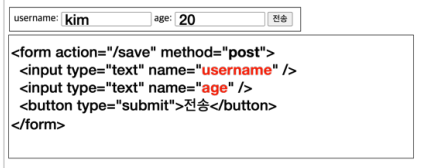
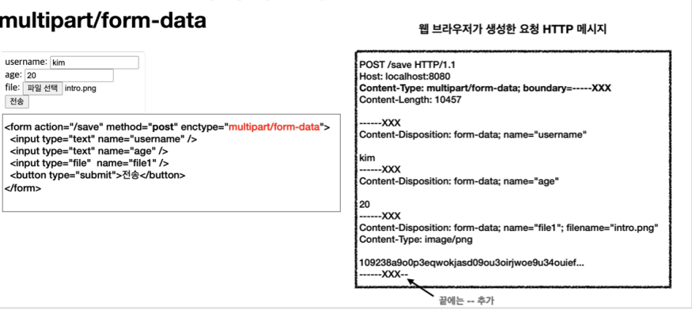

application/x-www-form-urlencoded 

sends data in the following manner

client sends :


server receives:


the data in the form is differentiated by &

but to upload a file, binary data is sent
(to be more specifc bytes lol) and not acutal string literals

and to add on to the equation, binary data is not the only data being sent.
Strings are as well.

to solve this issuem 
HTTP uses multipart/form-data



multipart/form data can send a vast array of different files with different encodings
(i mean they are bytes so)
and form content. This is where the name derives.


The resulting HTTP message from the form's input
shows each segment sent being separated

There is a additional header called Content-Disposition for each category(segment)
and there are additional data to help identify, etc.

in the example above, each of the input category
age, username, file1 are separated.
with the data for username and age having data in the form of a String literal
while the file being sent in bytes.

multipart form data in this sense is far more complicated then
application/x-www-form-urlencoded as it is made up of many parts

to utilise these Parts,

one can receive the parts from HttpServletRequest
through the getParts() method which returns a Collection of Parts -> java.servlet.http.Part

one can receive the headers from the parts obtained through the getHeaderNames() method in Part
which will return a collection of header names of the individual parts

part also have a getInputStream() method for file objects, that will return a stream of bytes

part also have getSubmittedFileName() to get the name of the file that the client uploaded

part.write() allows the data sent through part to be written elsewhere

```
documentation of Part : https://docs.oracle.com/javaee/7/api/javax/servlet/http/Part.html
documentation of HttpServletRequest : https://docs.oracle.com/javaee/7/api/javax/servlet/http/HttpServletRequest.html
```


limits can be set on the data that are sent through multipart by modifying the following properties on application.properties

```
spring.servlet.multipart.max-file-size=1MB
spring.servlet.multipart.max-request-size=10MB
```

If the multipart file size exceeds the above limits
where max-file-size shows the maximum file size for a single file
and max-request-size shows the maximum size of the entire multipart request (multiple files, etc)

SizeLimitExceededException will show


HttpServletRequest has a Facade called RequestFacade that needs to be implemented.
For multiparts, it is the servlet's StandardMultipartHttpServletRequest
that implement the multipart request handling.

The option to enable or disable multiparts can be done through application.properties with the following
spring.servlet.multipart.enabled, which is true by default but can be disabled by (=false)

The chain of action is such that when
spring.servlet.multipart.enabled is set to true, 
Spring's DispatcherServlet will engage the MultipartResolver.
The MultipartResolver will convert HttpServletRequest into a MultipartHttpServletRequest Object, 
a subclass of HttpServletRequest,
with additional functionalities on Multiparts.
To be more specific, the MultipartResolver will return StandardMultiPartHttpServletRequest that implements the MultipartHttpServletRequest
through DI.
But given that there is a much more convenient MultipartFile class, MultipartHttpServletRequest is not 
really well used.

More information will be available with MultipartResolver docs


filedirectory for uploads can be set by adding the following to application.properties
file.dir="{desired dir/}"
[please remember to put an / at the end of the dir.]

Parts provided by servlet is convenient in a way but it requires HttpServletRequest and it needs quite a bit of boilerplate
code to get to the file sent through the multipart Request

Spring provides an abstraction for files sent through multipart requests, through the MultiPartFile interface

MultipartFile can be directly obtained through @RequestParam.
One just need to be aware that the name of the HTML Form's name should be used for the @RequestParam
MultipartFile can also be used together with @ModelAttribute, similar to @RequestParam

some Notable methods provided by MultipartFile is

getOriginalFileName() -> provides the file name of the uploaded file
transfer() -> allows the file uploaded to be transferred to disk -> allows the file to be saved


------------------------------------------------------------------------------------------------------------------------

note for FileStore example,

FileStore was created to provide a different name for the file that the client uploads to the server.
The user's filename is not directly stored onto the server due to potential collisions of the file names,
as there may already be an existing file on the server with the same original file name as the one that the current user is uploading
Should there be a different name for a file on a server, then there needs to be certain hashing functions that can be reversed
that ensures no collision among the stored serverFileNames, and a link to the original file (I know it is pretty dumb to add this 
but people do forget so)


------------------------------------------------------------------------------------------------------------------------------------

for the ItemController example,


@GetMapping("/items/new") : shows the item registration form
@PostMapping("/items/new") : stores the item form and redirects to page to show the stored data
@GetMapping("/items/{id}") : shows the item
@GetMapping("/images/{filename}") : used when searching with the  tag.
UrlResource() reads the image file and returns the image Binary through @ResponseBody
@GetMapping("/attach/{itemId}") : used when downloading files. itemId needed as method created based on expectation that
in the future there may be potential authority/access-right checks, where itemId is needed.
It is best practice to let the file name of the downloaded file be the same as what the client/User uploaded.
Should this be the case, within the Content-Disposition header, attachment ; filename = {"uploadedFileName"} is suffice


-------------------------------------------------------------------------------------------------------------------------------------
within a html file,
<input type="file" multiple="multiple"
name="imageFiles" >
the multiple = "multiple" option allows for multiple file uploads
which can be obtained from (MultipartFormObject).getImageFiles() method
